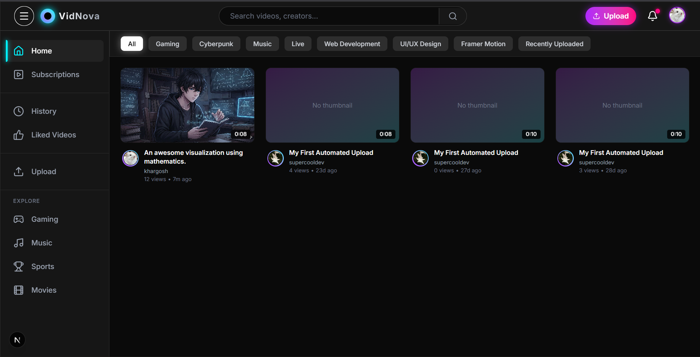
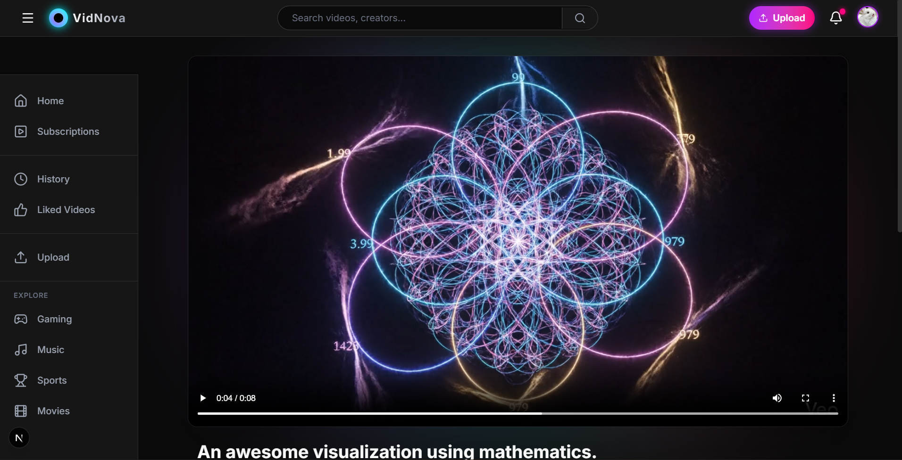
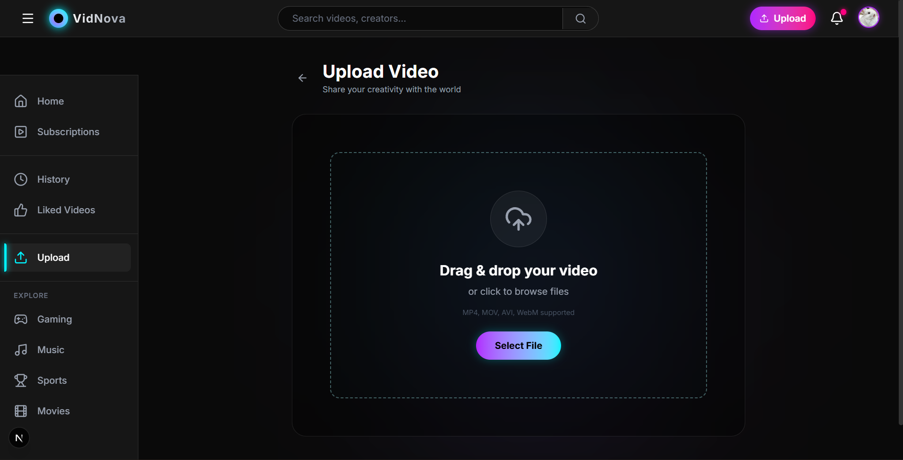
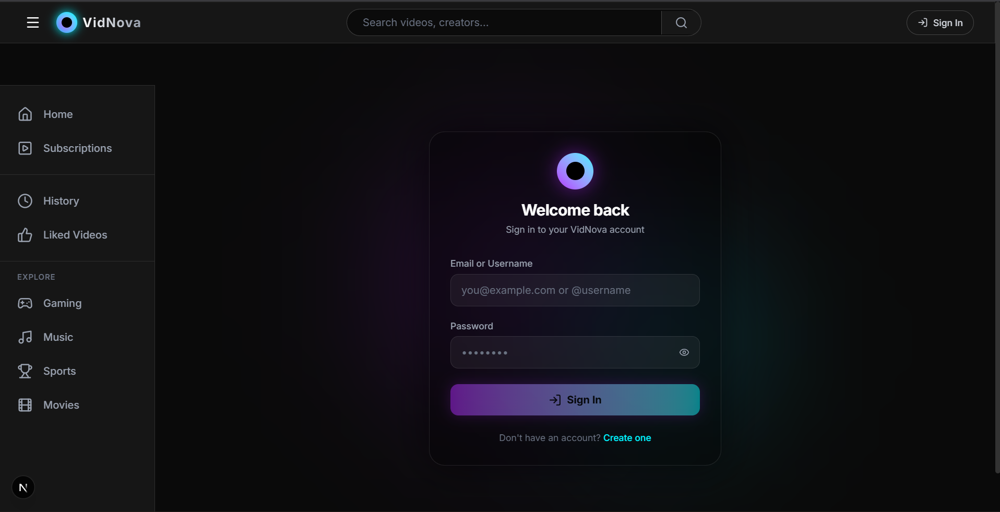
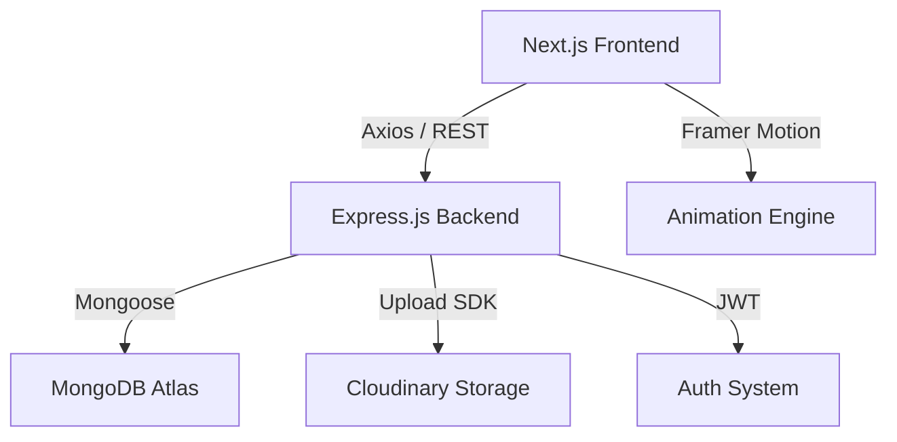

# 🌌 VidNova: The Future of Streaming

<div align="center">
  <p align="center">
    
    
    
    
    
  </p>
  <p align="center">
    
    
    
    
    
  </p>
  
  **A high-performance, animation-driven video platform with a stunning Cyberpunk soul.**
</div>

---

## 📖 Introduction

**VidNova** is not just another video sharing site; it's a visual experience. Built for speed and aesthetics, it leverages the cutting-edge capabilities of **Next.js 15** and **React 19** to deliver instantaneous navigation and rich, fluid animations. Whether you are a creator looking for a home or a viewer seeking a vibrant community, VidNova provides a premium "Glassmorphism" environment that feels alive.

## 🚀 Key Features

### 🎬 For Viewers
- **Seamless Playback**: Optimized streaming with custom controls and real-time view tracking.
- **Vibrant Discovery**: Search-as-you-type and category-based filtering using Next.js client-side transitions.
- **Engagement**: Like your favorite videos, subscribe to creators, and participate in threaded discussions.
- **History & Likes**: Automatically track your viewing history and maintain a curated list of liked content.

### ✍️ For Creators
- **Effortless Uploads**: Robust drag-and-drop interface with real-time upload progress simulation.
- **Channel Branding**: Customize your presence with unique banners and avatars stored securely in the cloud.
- **Analytics at a Glance**: Track subscriber growth and video engagement directly on your profile.

### 🛠️ Technical Excellence
- **Hybrid Rendering**: Leveraging Server Components for SEO and Client Components for interactivity.
- **Type-Safe Architecture**: End-to-end TypeScript integration ensures a reliable developer experience.
- **Cyberpunk UI**: A custom design system built with Tailwind CSS, featuring neon glows and micro-interactions.

---

## 📸 Visual Showcase

| Home Feed | Video Player |
| :---: | :---: |
|  |  |

| Creator Dashboard | Authentication |
| :---: | :---: |
|  |  |

---

## 🏗️ Project Architecture



---

## 🛠️ Getting Started

### Prerequisites
- **Node.js**: `v18.0.0` or higher
- **Package Manager**: `npm` or `yarn`
- **Cloudinary Account**: For media storage

### 1. Clone & Install
```bash
git clone https://github.com/Abhinav943/VidNova.git
cd VidNova

# Install dependencies for both halves
cd Backend && npm install
cd ../frontend && npm install
```

### 2. Environment Configuration
Create a `.env` in the **Backend** folder:
```env
PORT=8000
MONGO_URI=your_mongodb_atlas_uri
CORS_ORIGIN=http://localhost:3000
ACCESS_TOKEN_SECRET=any_long_random_string
REFRESH_TOKEN_SECRET=any_longer_random_string
CLOUDINARY_CLOUD_NAME=your_name
CLOUDINARY_API_KEY=your_key
CLOUDINARY_API_SECRET=your_secret
```

### 3. Launch the Platform
Open two terminals:

**Terminal 1 (Backend):**
```bash
cd Backend && npm run dev
```

**Terminal 2 (Frontend):**
```bash
cd frontend && npm run dev
```

Your app will be live at `http://localhost:3000`!

---

## 📜 License
Distributed under the MIT License. See `LICENSE` for more information.

## 🤝 Contact
Abhinav - [@Abhinav943](https://github.com/Abhinav943)  
Project Link: [https://github.com/Abhinav943/VidNova](https://github.com/Abhinav943/VidNova)

<div align="center">
  <sub>Built with ❤️ by the Abhinav943</sub>
</div>
