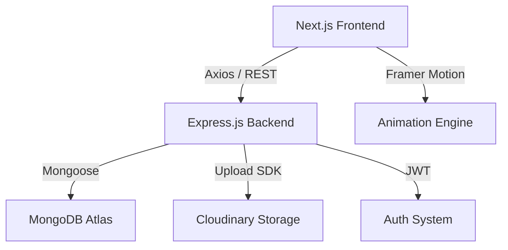

# 🌌 VidNova: The Future of Streaming

<div align="center">
  <p align="center">
    
    
    
    
    
  </p>
  <p align="center">
    
    
    
    
    
  </p>
  
  **A high-performance, animation-driven video platform with a stunning Cyberpunk soul.**
</div>

---

## 📖 Introduction

**VidNova** is a video sharing platform I built to learn full-stack web development. It's a YouTube-like app where you can upload videos, watch content, like videos, leave comments, and subscribe to creators. The project uses modern tools like **Next.js 15**, **React 19**, and **Express.js** to handle everything from smooth animations on the frontend to secure user authentication and video storage on the backend.

## 🚀 Key Features

### 🎬 Viewer Features
- **Watch Videos**: Play videos with custom player controls and automatic view tracking.
- **Search & Browse**: Find videos by searching or browsing through categories.
- **Interact**: Like videos, subscribe to creators, and comment on videos.
- **Track History**: Keep a history of videos you've watched and a list of videos you've liked.

### ✍️ Creator Features
- **Upload Videos**: Drag and drop to upload videos with a progress indicator.
- **Create a Channel**: Customize your profile with a banner and avatar.
- **Track Growth**: See how many subscribers you have and how many people watched your videos.

### 🛠️ Built With
- **Frontend**: Next.js, React, TypeScript, Tailwind CSS, and Framer Motion for animations.
- **Backend**: Express.js with Node.js for the API and MongoDB for the database.
- **Storage**: Cloudinary for storing videos and images.
- **Authentication**: JWT tokens for secure login and session management.

---

## 📸 Visual Showcase

| Home Feed | Video Player |
| :---: | :---: |
|  |  |

| Creator Dashboard | Authentication |
| :---: | :---: |
|  |  |

---

## 🏗️ Project Architecture



---

## 🛠️ Getting Started

### Prerequisites
- **Node.js**: `v18.0.0` or higher
- **Package Manager**: `npm` or `yarn`
- **Cloudinary Account**: For media storage

### 1. Clone & Install
```bash
git clone https://github.com/Abhinav943/VidNova.git
cd VidNova

# Install dependencies for both halves
cd Backend && npm install
cd ../frontend && npm install
```

### 2. Environment Configuration
Create a `.env` in the **Backend** folder:
```env
PORT=8000
MONGO_URI=your_mongodb_atlas_uri
CORS_ORIGIN=http://localhost:3000
ACCESS_TOKEN_SECRET=any_long_random_string
REFRESH_TOKEN_SECRET=any_longer_random_string
CLOUDINARY_CLOUD_NAME=your_name
CLOUDINARY_API_KEY=your_key
CLOUDINARY_API_SECRET=your_secret
```

### 3. Launch the Platform
Open two terminals:

**Terminal 1 (Backend):**
```bash
cd Backend && npm run dev
```

**Terminal 2 (Frontend):**
```bash
cd frontend && npm run dev
```

Your app will be live at `http://localhost:3000`!

---

## 📜 License
Distributed under the MIT License. See `LICENSE` for more information.

## 🤝 Contact
Abhinav - [@Abhinav943](https://github.com/Abhinav943)  
Project Link: [https://github.com/Abhinav943/VidNova](https://github.com/Abhinav943/VidNova)

<div align="center">
  <sub>Built with ❤️ by the Abhinav943</sub>
</div>
