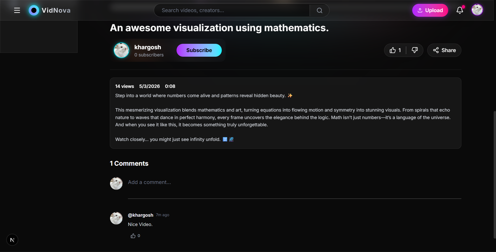

# VidNova - Cyberpunk Video Streaming Platform


<div align="center">
  
  
  
  
  
  
  
  
</div>

VidNova is a premium, animation-heavy video streaming platform designed with a vibrant Cyberpunk aesthetic. Built using the modern MERN stack (Next.js 15, Node.js, Express, and MongoDB), it offers a seamless experience for creators and viewers alike.

## ✨ Key Features

- **Dynamic Video Feed**: Interactive category chips with real-time search and smooth transitions.
- **Advanced Video Player**: Custom streaming interface with view counting and watch history integration.
- **Creator Channels**: Dedicated channel pages featuring banners, avatars, and video collections.
- **Engagement Suite**: Real-time likes, subscriptions, and a nested comment system.
- **Secure Authentication**: JWT-based login/registration with automatic session management.
- **Cloud Storage**: Seamless media handling via Cloudinary for videos and high-res thumbnails.
- **Glassmorphism UI**: A stunning dark-mode interface with neon accents and Framer Motion animations.

## 📸 Screenshots

### 1. Home Feed
The central hub featuring categories and neon-themed video cards.


### 2. Video Streaming
A distraction-free, cinematic viewing experience.


### 3. Engagement & Details
Rich metadata display with interactive subscription and like buttons.


### 4. Authentication
Sleek, secure login portal with floating glassmorphism design.


### 5. Creator Upload
Drag-and-drop interface for seamless video publishing.


## 🚀 Tech Stack

### Frontend
- **Framework**: Next.js 15 (App Router)
- **Styling**: Tailwind CSS
- **Animations**: Framer Motion
- **Icons**: Lucide React
- **State Management**: React Context API

### Backend
- **Runtime**: Node.js
- **Framework**: Express.js
- **Database**: MongoDB (Mongoose)
- **Authentication**: JWT & Cookie-Parser
- **File Handling**: Multer & Cloudinary SDK

## 🛠️ Installation & Setup

### Prerequisites
- Node.js (v18+)
- MongoDB Atlas account
- Cloudinary account

### 1. Clone the repository
```bash
git clone https://github.com/yourusername/VidNova.git
cd VidNova
```

### 2. Backend Setup
```bash
cd Backend
npm install
```
Create a `.env` file in the `Backend` directory:
```env
PORT=8000
CORS_ORIGIN=http://localhost:3000
MONGO_URI=your_mongodb_uri
ACCESS_TOKEN_SECRET=your_secret
REFRESH_TOKEN_SECRET=your_secret
CLOUDINARY_CLOUD_NAME=your_name
CLOUDINARY_API_KEY=your_key
CLOUDINARY_API_SECRET=your_secret
```
Start the backend:
```bash
npm run dev
```

### 3. Frontend Setup
```bash
cd ../frontend
npm install
```
Start the frontend:
```bash
npm run dev
```

## 📜 License
This project is licensed under the MIT License - see the [LICENSE](LICENSE) file for details.

---
*Built with 💜 by the VidNova Team*
